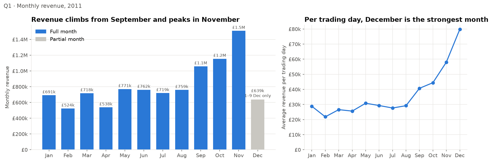
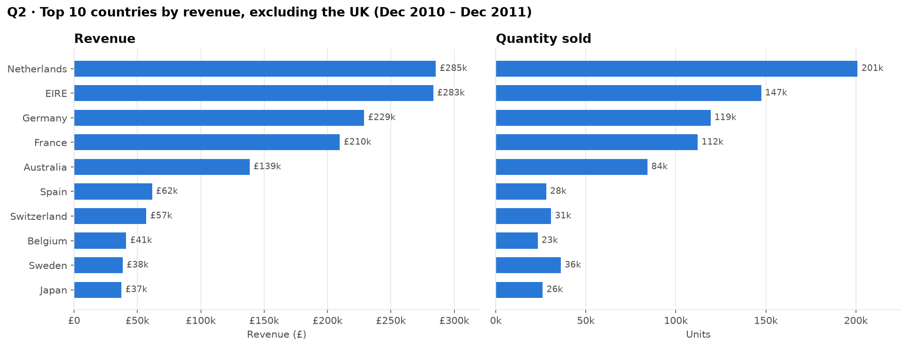
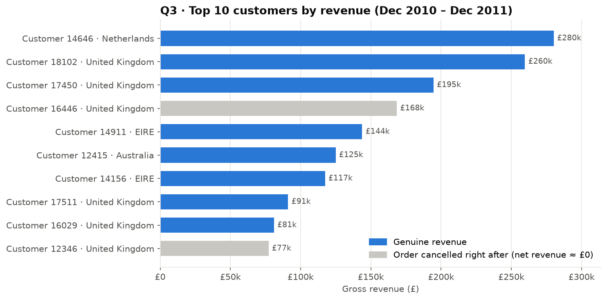
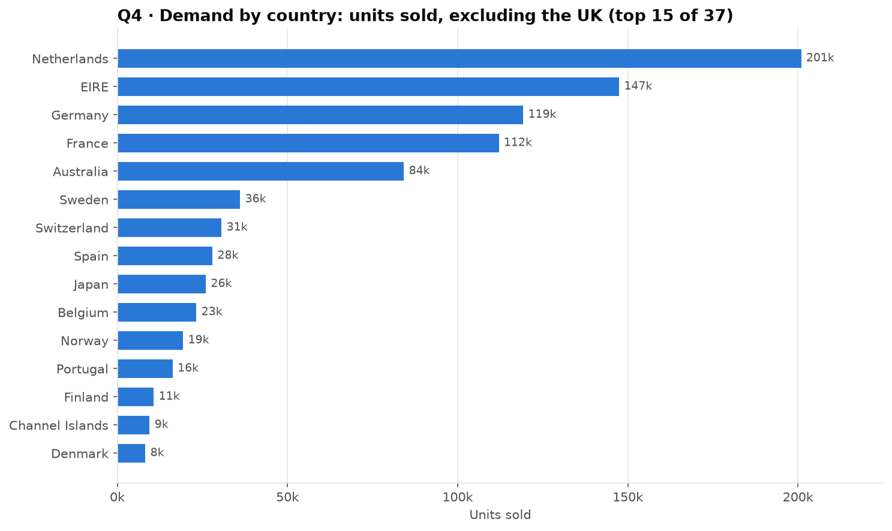

# Online Retail: Business Insights for the CEO & CMO

> Tata **Data Visualisation: Empowering Business with Effective Insights** job simulation (Forage):
> cleaning and analysing 540k transactions from a UK online retailer, answering 4 business questions with
> Python and Power BI.


## Business problem

A UK-based online gift retailer wants to use its transaction history to guide strategy. The CEO and CMO asked four questions:

| # | Question | Why it matters |
|---|---|---|
| Q1 | How did **revenue evolve month by month in 2011**? | Spot seasonality to support forecasting |
| Q2 | What are the **top 10 countries by revenue and quantity** (excl. UK)? | Prioritise international markets |
| Q3 | Who are the **top 10 customers by revenue**? | Target and retain high-value customers |
| Q4 | Which **regions have the highest demand** (excl. UK)? | Identify expansion opportunities |

## Key results

| | Finding | Recommendation |
|---|---|---|
| **Q1** | Revenue is flat Jan–Aug (~£0.5–0.8M/month), then **rises sharply Sep–Nov**, peaking at **£1.5M in November**. The December "drop" is an artefact: the data stops on 9 Dec, and per trading day December is the strongest month. | Plan stock, staff and campaigns for a Q4 peak starting in September |
| **Q2** | **Netherlands, EIRE, Germany, France** generate >60 % of international revenue. But one customer makes up 98 % of Dutch revenue, and EIRE has only 3 customers. | Treat NL and EIRE as key accounts to protect, not as markets |
| **Q3** | **2 of the "top 10" customers are false positives**: each placed a huge order (≈75–80k units) and cancelled it within minutes. Ranked on **net** revenue, the real top 10 make up ~15 % of identified revenue. | Rank customers on net revenue, and launch a key-account program |
| **Q4** | Demand is concentrated in Western Europe: the top 5 countries account for 72 % of international units. | **Germany & France** combine high demand with a broad customer base (~90 customers each). They are the best-balanced expansion targets |

<p align="center">
  
</p>
<p align="center">
  
</p>
<p align="center">
  
  
</p>

## Data

- **Source:** [UCI Machine Learning Repository: Online Retail](https://archive.ics.uci.edu/dataset/352/online+retail) (CC BY 4.0), also provided in the Forage simulation.
- **Scope:** 541,909 invoice lines, 01/12/2010 → 09/12/2011, 4,372 customers, 38 countries, amounts in £.
- **Columns:** `InvoiceNo`, `StockCode`, `Description`, `Quantity`, `InvoiceDate`, `UnitPrice`, `CustomerID`, `Country`.
- **Privacy:** customers are identified only by an anonymised numeric ID. The dataset contains no personal data.
- The data is **not versioned** in this repository (~90 MB). It is downloaded automatically by the pipeline (see [Reproduce](#reproduce-the-analysis)).

## Approach

1. **Data quality assessment** ([notebook 01](notebooks/01_data_quality_and_cleaning.ipynb)): missing values, duplicates, cancellations, stock adjustments, outliers, non-product lines.
2. **Cleaning** (brief's rules): remove `Quantity < 1` and `UnitPrice < 0`. 531,283 rows kept (98 %). Compute `Revenue = Quantity × UnitPrice` and add calendar features.
3. **Business analysis** ([notebook 02](notebooks/02_business_analysis.ipynb)): one section per question, each with a chart, a table and written interpretation, plus a sensitivity check on the customer ranking.
4. **Dashboard** ([`powerbi/`](powerbi/)): a 4-page Power BI report, one page per question, built on the cleaned dataset.

The cleaning and aggregation logic lives in a small, tested Python package ([`src/online_retail`](src/online_retail/)), so the notebooks stay focused on analysis and narrative.

## Data quality, assumptions & limitations

| Issue | Size | Treatment |
|---|---|---|
| Missing `CustomerID` | 25 % of lines, 16 % of revenue | Kept for revenue and country analysis, excluded from customer ranking |
| Cancellations (`C…` invoices) & returns | 9,288 lines | Removed (`Quantity < 1`) |
| Zero-priced stock adjustments ("damaged", "check"…) | 1,336 lines | Removed (`Quantity < 1`) |
| Bulk orders cancelled within minutes | 2 lines, £246k (2.3 % of revenue) | Kept by the brief's rules, corrected in Q3 with **net revenue** |
| Non-product lines (postage, Amazon fees, manual entries) | ~4 % of revenue | Kept as revenue, as in the brief. Documented |
| Exact duplicate lines | ~1 % of lines, 0.2 % of revenue | Kept: can't be told apart from real repeat lines |
| Partial last month | Dec 2011 = 1–9 Dec | Flagged in Q1, compared per trading day |

Other limitations: only one year of history, so seasonality isn't confirmed. `Country` is the customer's residence, not the shipping destination. Amounts are not adjusted for inflation.

## Repository structure

```text
.
├── data/
│   ├── raw/                 # online_retail.xlsx (downloaded, not versioned)
│   └── processed/           # online_retail_clean.csv (generated, used by Power BI)
├── docs/
│   └── forage_certificate.pdf
├── notebooks/
│   ├── 01_data_quality_and_cleaning.ipynb
│   └── 02_business_analysis.ipynb
├── powerbi/
│   └── Online_Retail_Analysis.pbix
├── reports/figures/         # charts exported by notebook 02
├── src/online_retail/
│   ├── data.py              # download, load, clean, export
│   ├── analysis.py          # aggregations for Q1–Q4 + data-quality checks
│   ├── plotting.py          # shared chart style
│   └── __main__.py          # `python -m online_retail` runs the pipeline
├── tests/                   # unit tests (pytest)
├── pyproject.toml
└── requirements.txt
```

## Reproduce the analysis

Requires Python 3.10+.

```bash
git clone https://github.com/hanae-MAYTA/tata-forage-data-visualisation.git
cd tata-forage-data-visualisation

python -m venv .venv
source .venv/bin/activate        # Windows: .venv\Scripts\activate
pip install -r requirements.txt  # installs the package + Jupyter + pytest

python -m online_retail          # downloads the raw data and writes data/processed/online_retail_clean.csv
jupyter lab notebooks/           # run 01 then 02
pytest                           # run the unit tests
```

To refresh the Power BI report, open `powerbi/Online_Retail_Analysis.pbix` and point the data source to
`data/processed/online_retail_clean.csv` on your machine.

## Tech stack

Python · pandas · Matplotlib · Jupyter · pytest · Power BI · Git

## Context

Completed as part of the [Tata Data Visualisation job simulation](https://www.theforage.com/) on Forage
([certificate](docs/forage_certificate.pdf)). The skills practised were framing the business scenario,
choosing the right visuals, creating effective visuals, and communicating insights.
